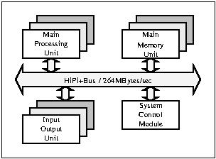

# HiPi+Bus: Highly Pipelined Plus Bus
The **HiPi+Bus (하이파이플러스버스)** is a shared bus with pipelined protocol supporting multi-cache coherency.

This document describes a background, a general overview of the HiPi+Bus protocol.
  
All contents are provided as it is WITHOUT ANY WARRANTY and NO TECHNICAL SUPPORT will be provided for problems
that might arise.

### Shared-bus system
HiPi+Bus connects multiple processor-boards and multiple memory-boards.

|  |
|:---:|
| *Shared-bus system* |

### HiPi+Bus overview

* *Supports shared memory multiple structures*:
In a multiprocessor structure using shared memory, when connecting the processor and memory using a bus, the system bus needs to be considered to support multiple processors in each part of the bus such as data transmission protocol, transmission speed, arbitration method, and interrupt.
* *High performance computer support*:
In order for the target multiprocessor to have high performance, the system bus must also provide the appropriate performance and function, and for this, data transmission capability, reliability of data transmission, system configuration capability, and functions for system maintenance must be considered.

* *Pended Protocols*:
The Pended protocol is a method of dividing one data transmission into a request phase and a response phase so that the memory access time does not affect the bus bandwidth. Since one processor does not continue to occupy the bus while accessing memory, this protocol is absolutely advantageous in a multiprocessor environment where multiple data transfer requests can occur simultaneously.
* *Synchronous - 16.5 MHz*:
The Pended protocol is a pipeline that divides data transmission into two stages: request and response. Therefore, it is not necessary to implement a protocol like this.
The synchronous control method is more advantageous than the synchronous control method. Compared to the asynchronous type, the synchronous control method has the advantage that it is difficult to obtain a resilient performance improvement according to the development of the technology, but it is highly reliable and can be implemented to exhibit better performance than the asynchronous type with the current technology. The clock period refers to the time when the unit bus operation is performed and is 60.6 nsec.
* *Fairness arbitration*:
One of the biggest advantages of a multi-processor system is the fast response that is obtained by sharing tasks by several processors. In order to make full use of these advantages, all processors are equally qualified and a balanced distribution of work at every moment (dynamic load).
 balancing) must be done. Balanced distribution has many responsibilities in the operating system, but first of all, equal resource sharing at the hardware level is guaranteed.
It is possible only if it is long. Since the bus is the most important resource, fair mediation of bus use can be said to be the starting point for balanced distribution. HiPi+Bus
 Arbitration rules are defined so that all bus modules can use the bus fairly.
* *Cache Coherency Protocols*:
The biggest problem with all multiprocessor systems using buses is the degradation of system performance due to bus saturation. If the bus is saturated, even if the number of processors increases, the performance of the system does not improve, but rather decreases. Using shared memory as a way to solve such problems
In a multi-processor system, each processor has a cache and uses the bus only when the desired data does not exist in the cache, thereby preventing bus saturation. However, if the cache is used independently for each processor, a multi-cache consistency problem may occur in which the data existing in the cache is broken with memory or other data in the cache, so this problem must be solved. HiPi+Bus supports write-back cache identity maintenance protocol.
* *Interlock Protocols*:
It supports locking protocol to support synchronization, which is essential in multiprocessing.
* *Interrupt Broadcast and Arbitration*:
In a multiprocessing system environment that uses shared memory, all processors operate with equal qualifications. Therefore, in the request and processing of interrupts, functions different from those of a single processor system are required. That is, since multiple processors can all handle interrupts, a method of sending an interrupt to multiple processors (broadcast) and a function (arbitration) of selecting a processor that will actually handle the interrupt are required. HiPi+Bus provides these interrupt functions and generalizes the interrupt to be used as an asynchronous communication means between all processors.

### HiPi+Bus specification

<table>
<tbody>
<tr><td colspan="2" align="center" bgcolor="lightblue">Characteristics of Arbitration</td></tr>
<tr><td>Arbitration rule  </td> <td>Priority and Fairness</td></tr>
<tr><td>Arbitration time  </td> <td>1 Bus Clock (60.6 nsec)</td></tr>
<tr><td>Arbitration method</td> <td>Linear Self Arbitration</td></tr>
<tr><td>Arbiter           </td> <td>Distributed Arbiter</td></tr>
<tr><td>Etc               </td> <td>Request Inhibition, Request Timeout</td></tr>
<tr><td colspan="2" align="center" bgcolor="lightblue">Characteristics of Data Transfer</td></tr>
<tr><td>Protocol                  </td><td>Pended</td></tr>
<tr><td>Timing                   </td><td>Synchronous</td></tr>
<tr><td>Clock speed              </td><td>16.5 MHz (60.6 nsec)</td></tr>
<tr><td>address/data             </td><td>non-multiplexed</td></tr>
<tr><td>maximum address space    </td><td>4 Gbytes (32 bits wide)</td></tr>
<tr><td>number of address regions</td><td>8 (3 defined)</td></tr>
<tr><td>maximum transfer types   </td><td>32 (13 defined)</td></tr>
<tr><td>Bus Width                </td><td>128 bits (16 bytes)</td></tr>
<tr><td>Data Unit                </td><td>8 bits (1 byte)</td></tr>
<tr><td>Transferable data size   </td><td>contiguous bytes within 16-byte; 64-byte</td></tr>
<tr><td>Alignment Restriction    </td><td>16 byte boundary; 64 byte boundary</td></tr>
<tr><td>Justification            </td><td>Straight (Nonjustified)</td></tr>
<tr><td>데이터 전송 속도(Data Transfer Rate) </td><td>264 Mbytes/sec (16Bytes x 16.5Mhz)</td></tr>
<tr><td colspan="2" align="center" bgcolor="lightblue">Characteristics for Interrupt Transfer</td></tr>
<tr><td>Protocol           </td><td>Message passing protocols</td></tr>
<tr><td>Control            </td><td>Synchronous</td></tr>
<tr><td>Clock speed        </td><td>16.5 MHz (60.6 nsec)</td></tr>
<tr><td>Transfer speed     </td><td>Maximum 1.6 MI/sec (Mega Interrupts per second)</td></tr>
<tr><td>Arbitration method </td><td>Coded Self Arbitration</td></tr>
<tr><td>Arbiter            </td><td>Distributed Arbiter</td></tr>
<tr><td>Error protection   </td><td>Parity Detection</td></tr>
<tr><td>Etc                </td><td>Broadcast and Arbitration</td></tr>
<tr><td colspan="2" align="center" bgcolor="lightblue">Etc.</td></tr>
<tr><td>Cache support     </td><td>Write Back Cache Coherency Protocol</td></tr>
<tr><td>Synchronization   </td><td>Semaphore Cache Protocol</td></tr>
<tr><td>Error Detection   </td><td>byte-wise odd parity</td></tr>
<tr><td>Error Handling    </td><td>Retry</td></tr>
<tr><td>Boundary Scan     </td><td>IEEE std.1149.1</td></tr>
<tr><td>Technology)       </td><td>BTL (IEEE std.1194.1)</td></tr>
<tr><td>number of slots   </td><td>21 slots/backplane</td></tr>
<tr><td>connector         </td><td>85x4rows (340pins, excluding power)</td></tr>
<tr><td>                  </td><td>40x4rows (160pins, excluding power)</td></tr>
<tr><td>Supply power      </td><td>+5V, +5V Standby</td></tr>
<tr><td>number of signals </td><td>293 (excluding power)</td></tr>
</tbody>
</table>

### Authors
The following people were involved in development of HiPi+Bus:
	Ando Ki (기안도),
	Won-Se Sim (심원세),
	Jong-Seok Han (한종석), and
	Yong-Ho Song (송용호).
 
The contributions of others are also acknowledged:
	Suk-Han Yoon (윤석한) as reviewer,
        Jin-Won Park (박진원) as overall manager, and
	Kee-Wook Rim (임기욱) as approver.

### Related projects
**High-Speed Mid-Range Computer Project: TICOM-III**
(1991 -- 1994, Funded by Ministry of Information and Communication;
joint project between ETRI and four major industry companies which are Daewoo, GoldStar, Hyundai and Samsung)
TICOM-III was a single-bus-based symmetrical multiprocessor computer and its processor was Intel Pentium microprocessor,
in which HiPi+Bus is used as backplane bus.

**NAIS Project: TICOM-II**
(1988 -- 1991, Funded by Ministry of Science and Technology;
joint project between ETRI and four major industry companies which are Daewoo, GoldStar, Hyundai and Samsung)
The objectives of NAIS (National Administrative Information System) were the design and development of a general-purpose multiprocessor computer called TICOM-II. TICOM-II was a single-bus-based symmetrical multiprocessor computer, and its processor was MC68030 microprocessor. My major area in the project was design of a high-bandwidth (100MByte/sec) pended-protocol back-plane bus called HiPi-Bus. HiPi-Bus consisted of a 64-bit data path with a non-multiplexed 32-bit address path. HiPi-Bus provided pended protocol, cache coherency protocol, dynamic hardware interrupt distribution and fair arbitration for multiprocessor environment.

### Related papers
1. Woo-Jong Hahn, Ando Ki, Kee-Wook Rim , and Soo-Won Kim, "A multiprocessor server with a new highly pipelined bus", 10th IPPS, April 1996, pp.512-517.
2. An Do Ki, Byung Kwan Park, Won Sae Sim, Kyeng Yong Kang, and Yong Ho Yoon, "Highly pipelined bus: HiPi-Bus", JTC-CSCC, Hiroshima Japan, 1991, pp.528-533

---
